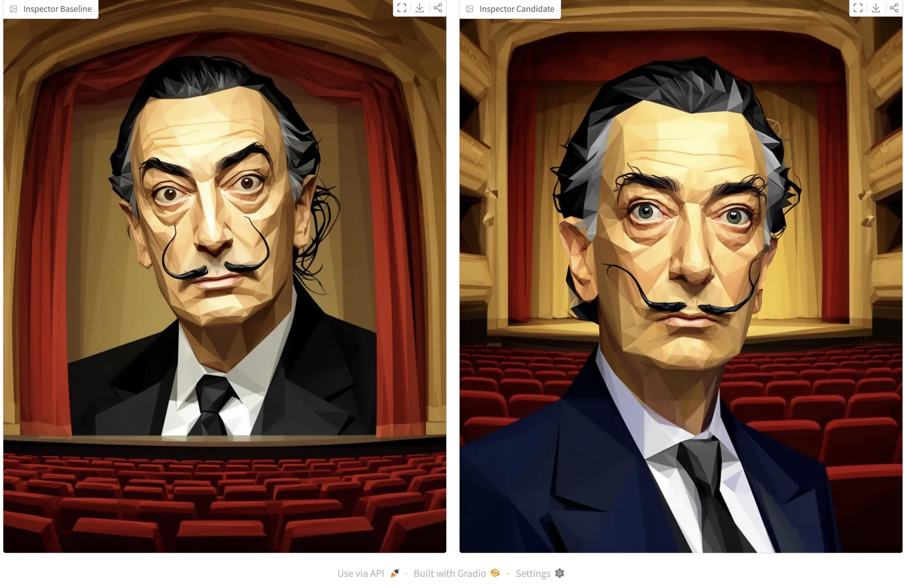

# Image Preference Modelling

Local research tool for optimizing image-generation prompts against personal preferences. The system keeps the image model frozen and evolves text prompts instead: sample an image prompt, generate baseline and candidate images, collect human head-to-head feedback, turn critiques into prompt mutations, and explicitly promote the best evaluated candidates.

The current control plane is a Gradio app called the **Gradio Operator Cockpit**.

## Introduction

This project tests how far text-only guidance can steer a "blind" image model without fine-tuning image weights. Image preference is subjective, so human comparisons are the source of truth. LLMs help with guided prompt sampling, critique interpretation, and reflective prompt mutation, but they do not decide which image won.

The loop is inspired by **Genetic-Pareto** prompt evolution: an LLM reflects on rollout critiques to propose mutations, while a Pareto-style frontier lets multiple winning aesthetic strategies coexist instead of collapsing into a single global best.

1. Sample or type a prompt.
2. Generate a no-system baseline and a candidate image using a saved system prompt.
3. Submit `left`, `right`, or `no_clear_winner` plus a critique.
4. Use the critique judge to estimate update strength and confidence without overriding the human.
5. Update candidate Elo, blended score, confidence, and frontier membership.
6. Generate a new prompt mutation once enough new feedback accumulates.
7. Sanity-check and explicitly promote evaluated frontier candidates.

The initial portrait experiments used:

- Prompt model: `deepseek-v4-flash`
- Image model: `sourceful/riverflow-v2-fast`
- Prompt data: `succinctly/midjourney-prompts`
- Task focus: portrait aesthetics



Known limitations: some visual preferences are hard to express precisely in words, and building a useful candidate pool is slow because each rollout needs baseline and candidate generation plus human feedback. A future direction is bootstrapping with a learned binary human preference model, then reserving richer textual feedback for selected examples.

See `docs/write-up.md` for the narrative writeup and example before/after images. See `docs/architecture.md` for the current flowchart and runtime architecture.

## Quick Start

This repo uses Python 3.13 and `uv`.

```bash
uv sync
uv run gradio-cockpit
```

The app stores local runtime state under `.local/`, downloaded prompt sources under `data/prompt_sources/`, and generated job images under `data/jobs/`.

## Environment

Environment variables are loaded from `.env` with `python-dotenv` and do not override already-exported values.

| Variable | Purpose |
|---|---|
| `OPENROUTER_API_KEY` | Required for OpenRouter model calls |
| `IMAGE_MODEL` | OpenRouter image-generation model ID |
| `PROMPT_MODEL` | OpenRouter model ID for prompt selection, critique judging, and prompt mutation |
| `OPENROUTER_BASE_URL` | Optional; defaults to `https://openrouter.ai/api/v1` |

If these are missing, offline/unit tests still work, but app actions that call real models will fail with explicit configuration errors.

## Contributor Map

The package lives in `src/image_preference_modelling/`.

- `config.py` loads model settings from the environment.
- `generation_pipeline.py` handles prompt-source caching/sampling and OpenRouter image generation.
- `prompt_sets/intent_rewriter.py` rewrites Midjourney-style prompts into concise visual intents.
- `storage/state_store.py` owns the SQLite schema, migrations, workflow records, candidate rewards, and integrity helpers.
- `storage/contracts.py` defines shared run/status types and artifact directory helpers.
- `gepa/scoring.py` converts completed rollout feedback into objective signals.
- `gepa/critique_judge.py` asks the prompt model to estimate preference margin and critique usefulness.
- `gepa/reward.py` implements Elo, confidence, and blended candidate score helpers.
- `gepa/mutation_engine.py` generates prompt mutations, with a heuristic fallback when model settings are unavailable.
- `gepa/optimizer.py` is the real `gepa` run worker: it scores selected feedback, chooses a parent candidate, creates a proposed mutation, and writes `checkpoint.json`.
- `jobs/job_launcher.py` dispatches background runs through a small thread pool. `gepa` is wired to real work; other run types still use the simulation stub.
- `gradio_app.py` wires the cockpit UI and accepts an injected `AppContext` for tests.

## App Workflows

The cockpit is organized into tabs:

- **Jobs** creates, selects, updates, and archives aesthetic jobs. Each job has a seed prompt and a seed candidate in the prompt pool.
- **Train / Compare** samples prompts, prepares candidate matchups, generates left/right images, and records feedback.
- **Prompt Evolution** runs mutations, shows mutation logs, promotes the best frontier candidate, and includes a Prompt Pool Explorer for inspecting, archiving, and unarchiving prompt candidates.
- **Best Candidate Check** compares the best evaluated training candidate against a no-system baseline for a typed prompt. This is a sanity check, not promotion.
- **Rollout Inspector** shows saved rollout metadata and image paths.

Important semantics:

- Human feedback controls the winner. The critique judge never flips the human outcome.
- The winner control is intentionally three-way: `left`, `right`, or `no_clear_winner`.
- Candidate statuses are `proposed`, `evaluating`, `evaluated`, and `archived`.
- Promotion requires an evaluated frontier candidate.
- Archived candidates remain inspectable but are excluded from normal pending/evaluated selection.
- Do not reintroduce `dspy` for this loop; the current design is a handrolled, human-guided mutation/evaluation loop for subjective preference.

## Testing

Run the default test suite:

```bash
uv run pytest
```

Run a focused test file:

```bash
uv run pytest tests/test_state_store.py
```

Tests that call real external services are marked `online` and skipped by default:

```bash
uv run pytest --online
```

When adding tests, keep local state isolated with `tmp_path`; tests should not touch `.local/`.

## Storage And Artifacts

`StateStore` uses SQLite at `.local/state/cockpit.db`. The schema is versioned; migrations run during initialization. Add new migrations append-only with `_migrate_vN_to_vN+1` methods and do not edit past migrations.

Run artifacts live under typed subdirectories in `.local/artifacts/`, including:

- `generation_runs/`
- `reward_model_versions/`
- `gepa_runs/`
- `evaluation_runs/`
- `rating_sessions/`

GEPA mutation runs write `checkpoint.json` with the selected rollouts, parent candidate, new candidate, objective scores, mutation metadata, and frontier snapshot.
