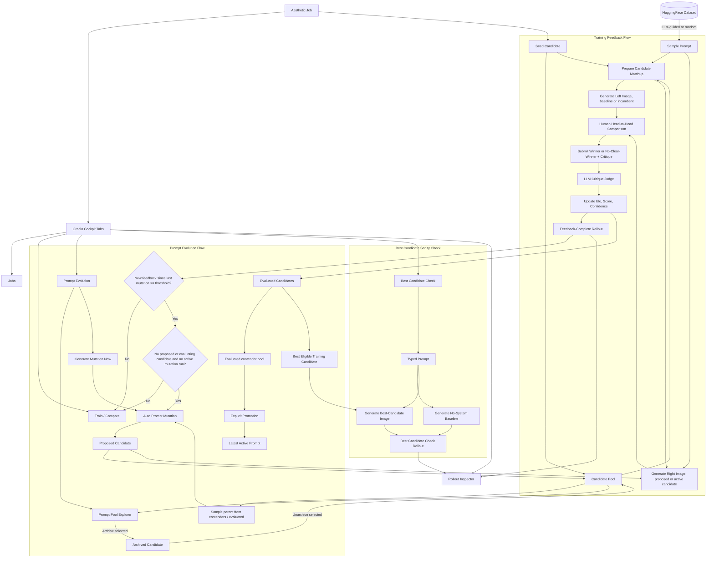

## Runtime Shape
The application is a local Gradio cockpit over a SQLite state store. `StateStore` owns the durable workflow state in `.local/state/cockpit.db`; generated images live under `data/jobs/<job_id>/images/<rollout_id>/`; run artifacts live under typed directories in `.local/artifacts/` such as `gepa_runs/<run_id>/`.

The package layers are:
- `config.py` loads OpenRouter settings for prompt/model calls.
- `generation_pipeline.py` samples Midjourney prompts from a cached HuggingFace parquet and generates baseline/candidate images through OpenRouter image-capable chat completions.
- `storage/state_store.py` stores jobs, rollouts, candidates, runs, events, rating sessions, comparisons, and schema migrations. The current schema version is 11.
- `gepa/` implements the human-guided prompt mutation loop: rollout scoring, critique judging, Elo/preference-score/confidence updates, mutation generation, and GEPA-run checkpointing.
- `jobs/job_launcher.py` dispatches runs on a small thread pool. `gepa` is the real worker path; other run types still use the simulation stub.
- `gradio_app.py` wires the workflow tabs and keeps all operator actions behind an injected `AppContext` for tests.

## State Model
An aesthetic job is the optimization target. It keeps the seed prompt, the latest promoted prompt, the previous baseline prompt, the active promoted candidate ID, and a feedback threshold for mutation.

Prompt versions are stored in `gepa_candidates`. New jobs create an evaluated seed candidate. Mutation runs create `proposed` candidates. Human comparisons move candidates into `evaluated` and update `elo`, `score` (Elo-derived preference rank on [0,1]), `confidence` (critique-informed evidence signal), win/loss/tie counts, judge metadata, and `frontier_member` (persisted contender-pool flag, recomputed after feedback). Candidates can also be `archived`; archived prompts remain visible in the Prompt Pool Explorer but are excluded from normal pending/evaluated selection.

Rollouts are generated comparisons. `baseline_candidate` compares a no-system baseline against a candidate prompt, `candidate_comparison` compares two saved candidate prompts, and `latest_prompt_check` stores one-off Best Candidate Check generations. Feedback-complete rollouts are the input to mutation gating.

## Operator Workflows
The training loop samples or accepts a prompt, prepares a matchup, generates left/right images, and records a three-way human outcome (`left`, `right`, or `no_clear_winner`) plus critique. The human winner is authoritative; the critique judge only estimates margin and critique usefulness for reward updates.

Prompt Evolution handles mutation runs, logs, promotion, and prompt-pool management. Mutation starts when enough new feedback has arrived and no proposed/evaluating candidate or active mutation run is blocking the pool. Operators can also run a mutation manually, archive pending candidates in bulk, promote the best evaluated contender, or inspect/archive/unarchive individual prompts in the Prompt Pool Explorer.

Best Candidate Check is a sanity check, not promotion. It chooses the best evaluated training candidate by preference score, Elo, confidence, and recency, then generates that candidate beside a no-system baseline for a typed prompt. Rollout Inspector shows saved rollout metadata and image paths for training and check rollouts.
