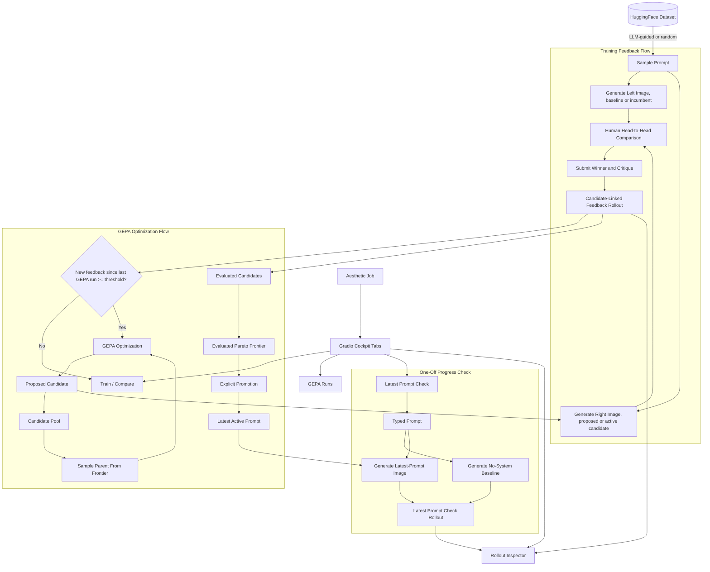

```mermaid
flowchart TD
    DS[("HuggingFace Dataset")]
    Job["Aesthetic Job"]
    UI["Gradio Cockpit Tabs"]
    TrainTab["Train / Compare"]
    GepaTab["GEPA Runs"]
    CheckTab["Latest Prompt Check"]
    InspectorTab["Rollout Inspector"]

    DS -->|"LLM-guided or random"| SP["Sample Prompt"]
    Job --> UI
    UI --> TrainTab
    UI --> GepaTab
    UI --> CheckTab
    UI --> InspectorTab

    subgraph trainingFlow ["Training Feedback Flow"]
        SP --> BL["Generate Left Image, baseline or incumbent"]
        SP --> CA["Generate Right Image, proposed or active candidate"]
        BL --> HC["Human Head-to-Head Comparison"]
        CA --> HC
        HC --> FB["Submit Winner and Critique"]
        FB --> RO["Candidate-Linked Feedback Rollout"]
    end

    subgraph optimizerFlow ["GEPA Optimization Flow"]
        RO --> GG{"New feedback since last GEPA run >= threshold?"}
        GG -->|"No"| TrainTab
        GG -->|"Yes"| GO["GEPA Optimization"]
        Pool["Candidate Pool"]
        Proposed["Proposed Candidate"]
        Evaluated["Evaluated Candidates"]
        Frontier["Evaluated Pareto Frontier"]
        Pool --> Parent["Sample Parent From Frontier"]
        Parent --> GO
        GO --> Proposed
        Proposed --> Pool
        Proposed --> CA
        RO --> Evaluated
        Evaluated --> Frontier
        Frontier --> Promote["Explicit Promotion"]
        Promote --> Active["Latest Active Prompt"]
    end

    subgraph checkFlow ["One-Off Progress Check"]
        CheckTab --> CheckPrompt["Typed Prompt"]
        Active --> CheckCandidate["Generate Latest-Prompt Image"]
        CheckPrompt --> CheckBaseline["Generate No-System Baseline"]
        CheckPrompt --> CheckCandidate
        CheckBaseline --> CheckRollout["Latest Prompt Check Rollout"]
        CheckCandidate --> CheckRollout
    end

    RO --> InspectorTab
    CheckRollout --> InspectorTab
```
